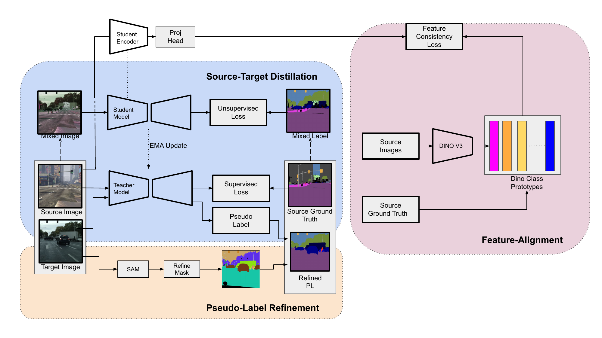
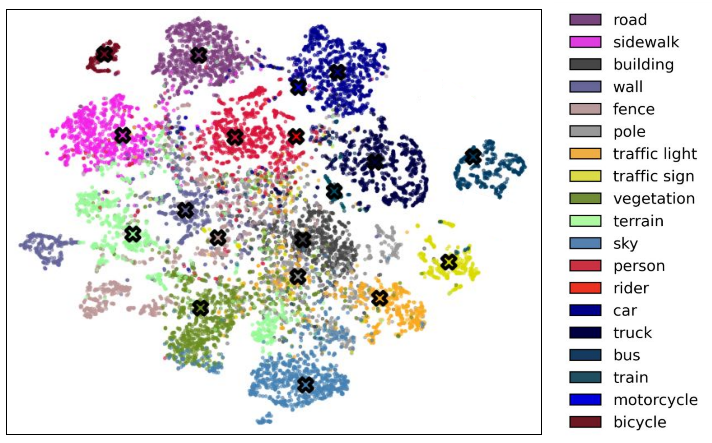

<h1 align="center">DFUDA: Dual-Foundation Models for Unsupervised Domain Adaptation</h1>

<p align="center">
  <strong>Yerin Cheon, Aruna Balasubramanian, and Francois Rameau</strong>
</p>

<p align="center">
  <a href="https://arxiv.org/abs/2605.03365"></a>
  <a href="#"></a>
</p>

<p align="center">
  Official implementation of <b>Dual-Foundation Models for Unsupervised Domain Adaptation</b>.
</p>

<p align="center">
  
</p>

# 📢 <b>News</b>

- **[2026-03-31]** We are pleased to share that our paper **DFUDA** has been accepted to **ICPR 2026**.

# <b>Abstract</b>

Semantic segmentation provides pixel-level scene understanding essential for autonomous driving and fine-grained perception tasks. However, training segmentation models requires costly, labor-intensive annotations on real-world datasets. Unsupervised Domain Adaptation (UDA) addresses this by training models on labeled synthetic data and adapting them to unlabeled real images. While conceptually simple, adaptation is challenging due to the domain gap---differences in visual appearance and scene structure between synthetic and real data.
Prior approaches bridge this gap through pixel-level mixing or feature-level contrastive learning. Yet, these techniques suffer from two major limitations: (1) reliance on high-confidence pseudo-labels restricts learning to a subset of the target domain, and (2) prototype-based contrastive methods initialize class prototypes from source-trained models, yielding biased and unstable anchors during adaptation.
To address these issues, we propose a dual-foundation UDA framework that leverages two complementary foundation models. First, we employ the Segment Anything Model (SAM) with superpixel-guided prompting to enable learning from a broader range of target pixels beyond high-confidence predictions. Second, we incorporate DINOv3 to construct stable, domain-invariant class prototypes through its robust representation learning. Our method achieves consistent improvements of +1.3\% and +1.4\% mIoU over strong UDA baselines on GTA->Cityscapes and SYNTHIA->Cityscapes, respectively.

# <b>Overview</b>

DFUDA is a framework for unsupervised domain adaptation in semantic segmentation. It combines foundation-model guidance from **SAM** and **DINOv3** to improve pseudo-label quality and feature alignment during teacher-student self-training.

## Method Highlights & Visualization

- **SAM-guided pseudo-label refinement** for broader target-domain supervision.
- **Superpixel-based prompting and mask filtering** for efficient and coherent SAM mask generation.
- **DINOv3 prototype-based feature alignment** for stable domain-invariant anchors.

<table>
<tr>
<td width="60%"></td>
<td width="40%"><b>SAM Mask Generation</b><br><br>Superpixel-guided prompting and mask filtering generate more segmentation-aware SAM masks with broader coverage and fewer prompts.</td>
</tr>
<tr>
<td width="40%"></td>
<td width="40%"><b>DINOv3 Feature Alignment</b><br><br>Class prototypes guide target features toward compact semantic clusters.</td>
</tr>
</table>

# <b>Results</b>

### Quantitative Results

<table width="50%" align="center">
<colgroup>
<col width="40%">
<col width="20%">
<col width="20%">
<col width="20%">
</colgroup>
<tr>
<th align="left">Benchmark</th>
<th align="right">Baseline</th>
<th align="right">DFUDA</th>
<th align="right">Improvement</th>
</tr>
<tr>
<td>GTA -> Cityscapes</td>
<td align="right">76.1 mIoU</td>
<td align="right"><b>77.4 mIoU</b></td>
<td align="right"><b>+1.3</b></td>
</tr>
<tr>
<td>SYNTHIA -> Cityscapes</td>
<td align="right">67.4 mIoU</td>
<td align="right"><b>68.8 mIoU</b></td>
<td align="right"><b>+1.4</b></td>
</tr>
</table>

### Ablation Study (Table 3, GTA→Cityscapes)

<table width="50%" align="center">
<colgroup>
<col width="18%">
<col width="20%">
<col width="18%">
<col width="14%">
<col width="18%">
<col width="12%">
</colgroup>
<tr>
<th align="left">Network</th>
<th align="left">UDA Method</th>
<th align="right">w/o SAM + DINO</th>
<th align="right">w/ DINO</th>
<th align="right"><b>w/ SAM + DINO</b></th>
<th align="right">Diff.</th>
</tr>
<tr>
<td>DeepLabV2</td><td>DACS</td><td align="right">55.93</td><td align="right">58.12</td><td align="right"><b>58.77</b></td><td align="right">+2.84</td>
</tr>
<tr>
<td>DeepLabV2</td><td>DAFormer</td><td align="right">57.55</td><td align="right">59.48</td><td align="right"><b>60.37</b></td><td align="right">+2.82</td>
</tr>
<tr>
<td>DeepLabV2</td><td>HRDA</td><td align="right">62.74</td><td align="right">63.41</td><td align="right"><b>64.80</b></td><td align="right">+2.06</td>
</tr>
<tr>
<td>DeepLabV2</td><td>MIC</td><td align="right">63.53</td><td align="right">64.81</td><td align="right"><b>65.36</b></td><td align="right">+1.83</td>
</tr>
<tr>
<td>DAFormer</td><td>DAFormer</td><td align="right">66.72</td><td align="right">68.45</td><td align="right"><b>69.17</b></td><td align="right">+2.45</td>
</tr>
<tr>
<td>DAFormer</td><td>HRDA</td><td align="right">73.72</td><td align="right">74.57</td><td align="right"><b>76.04</b></td><td align="right">+2.32</td>
</tr>
<tr>
<td>DAFormer</td><td>MIC</td><td align="right">75.19</td><td align="right">76.18</td><td align="right"><b>77.40</b></td><td align="right">+2.21</td>
</tr>
</table>

### Qualitative Results

<p align="center">
  
</p>

# <b>Environment Setup</b>

This repository is based on the [MIC](https://github.com/lhoyer/MIC) codebase and follows the [MMSegmentation](https://github.com/open-mmlab/mmsegmentation)-style training pipeline.

We provide two setup options: Docker for reproducibility and pyenv/manual setup for users who prefer a local Python environment.

### Option 1: Docker

Build the Docker image from the repository root:

```shell
docker build -t dfuda:v1.0 -f docker/Dockerfile .
```

Run the container:

```shell
sh run_docker.sh
```

The Docker environment uses Ubuntu 20.04, CUDA 11.0.3, Python 3.8.10, PyTorch 1.7.1, and MMCV 1.3.7.

### Option 2: pyenv / Manual Setup

Python 3.8.10 is recommended.

```shell
pyenv install 3.8.10
pyenv local 3.8.10
python -m venv ~/venv/dfuda
source ~/venv/dfuda/bin/activate
```

Install the required packages:

```shell
pip install -r requirements.txt -f https://download.pytorch.org/whl/torch_stable.html
pip install mmcv-full==1.3.7
```

Download MiT-B5 ImageNet pretrained weights from the [SegFormer](https://github.com/NVlabs/SegFormer?tab=readme-ov-file#training) and place them under `pretrained/`.

# <b>Setup Dataset</b>

Arrange each dataset under **`data/`** as in the tree below, and download the archives as follows:

- **Cityscapes:** Log in through the [Cityscapes download portal](https://www.cityscapes-dataset.com/login/), download **`leftImg8bit_trainvaltest.zip`** and **`gt_trainvaltest.zip`**, extract them into **`data/cityscapes/`**.
- **GTA:** From [Playing for Data (GTA)](https://download.visinf.tu-darmstadt.de/data/from_games/), download **all** listed image bundles and matching label bundles, extract into **`data/gta/`**.
- **SYNTHIA (optional):** From the [SYNTHIA downloads page](https://synthia-dataset.net/downloads/), get **`SYNTHIA-RAND-CITYSCAPES`** for SYNTHIA→Cityscapes and extract into **`data/synthia/`**.

<h3>Expected layout:</h3>

```none
DFUDA
├── ...
├── data
│   ├── cityscapes
│   │   ├── leftImg8bit
│   │   │   ├── train
│   │   │   ├── val
│   │   ├── gtFine
│   │   │   ├── train
│   │   │   ├── val
│   ├── gta
│   │   ├── images
│   │   ├── labels
│   └── synthia (optional)
│       ├── RGB
│       └── GT
│           └── LABELS
└── pretrained
```

<h3>Run preprocessing:</h3>

```shell
python tools/convert_datasets/gta.py data/gta --nproc 8
python tools/convert_datasets/cityscapes.py data/cityscapes --nproc 8
python tools/convert_datasets/synthia.py data/synthia/ --nproc 8
```

# <b>Setup Foundation-Models Guidance</b>

Before training **w/ DINO** or **w/ SAM + DINO** variants, complete both steps below.

## Superpixel-Guided SAM Masks

<h3>1) Prepare SAM pretrained checkpoint</h3>

Download the SAM ViT-H checkpoint (`sam_vit_h_4b8939.pth`) from the
[Segment Anything repository](https://github.com/facebookresearch/segment-anything)
and place it under `pretrained_model/SAM/`.

```shell
pretrained_model/SAM/sam_vit_h_4b8939.pth
```

<h3>2) Create image path CSV for mask generation</h3>

```shell
# Default: img_name, src_img
python utils/data_csv.py --dataset cityscapes --split train

# Optional: include GT path column (gt_color for GTA, gt_id for Cityscapes/SYNTHIA)
python utils/data_csv.py --dataset cityscapes --split train --include-gt
```

Generated CSV files are saved to `utils/data_path/` by default.

<h3>3) Generate Superpixel-Guided SAM Mask IDs</h3>

```shell
python utils/save_sam_superpixel_masks.py --dataset cityscapes_train
```

Generated masks are saved under each dataset directory. For Cityscapes:

```none
data/cityscapes/cityscapes_train_sam_mask_superpixel/aachen/aachen_000000_000019_gtFine_labelTrainIds.png
```

Note: The mask filtering threshold can be adjusted in `utils/utils.py`
through `min_area` and `min_non_overlap_area` in `labeled_mask`.
We use the default value of `800` for all experiments.

## Build DINOv3 Class Prototypes

[DINOv3](https://github.com/facebookresearch/dinov3) uses a newer Python/PyTorch stack than the DFUDA training environment.
Prototype extraction uses a separate Docker image while sharing the same repository and `data/` directory.

Run the following from a **host terminal** at the repository root (not inside `dfuda:v1.0`):

<h3>1) Clone the DINOv3 repository</h3>

```none
DFUDA/dinov3/
```

<h3>2) Build and run the DINOv3 container</h3>

```shell
docker build -t dfuda-dinov3:v1.0 -f docker/Dockerfile.dinov3 .
sh run_docker_dino.sh
```

<h3>3) Prepare GTA image/label CSV and DINOv3 weights</h3>

```shell
python utils/data_csv.py --dataset gta --include-gt --gt-type trainid
mkdir -p pretrained_model/DINOv3
# Download ViT-L/16 distilled checkpoint from the official DINOv3 page
wget "<DINOv3_WEIGHT_URL>" -O pretrained_model/DINOv3/dinov3_vitl16_pretrain_lvd1689m-8aa4cbdd.pth
```

Set the same weight path in `utils/calc_src_dino_prototypes.py`.

<h3>4) Build source-domain class prototypes</h3>

```shell
mkdir -p prototypes
python utils/calc_src_dino_prototypes.py --mode orig
```

Output:

```none
prototypes/prototypes_19classes_orig.pt
```

# <b>Training</b>

Run training inside the main DFUDA Docker container (`dfuda:v1.0`):

```shell
sh run_docker.sh
```

### Table 3 experiments (GTA→Cityscapes)

Each `--exp` ID generates **3 configs** and runs them sequentially:

| Variant | SAM | DINO |
|---------|-----|------|
| `baseline` | ✗ | ✗ |
| `dino` | ✗ | ✓ |
| `full` | ✓ | ✓ |


```shell
# Example: DeepLabV2 + DACS (baseline → dino → full)
python run_experiments.py --exp 201
```


Generated configs are saved under `configs/generated/`. Checkpoints and logs are saved under `work_dirs/`.

# <b>Evaluation</b>

After training, evaluate a run inside the same container:

```shell
sh run_docker.sh
sh test.sh work_dirs/local-exp201/<run_name>/
```

This loads `latest.pth`, computes **mIoU** on the Cityscapes validation set, and saves colorized predictions to `work_dirs/.../preds/`.

You can also evaluate a single generated config directly:

```shell
python -m tools.test configs/generated/local-exp201/<config>.py \
  work_dirs/local-exp201/<run_name>/latest.pth --eval mIoU
```

# <b>Citation</b>

If you find this work useful, please cite:

```bibtex
@misc{cheon2026dualfoundationmodelsunsuperviseddomain,
  title={Dual-Foundation Models for Unsupervised Domain Adaptation},
  author={Yerin Cheon and Aruna Balasubramanian and Francois Rameau},
  year={2026},
  eprint={2605.03365},
  archivePrefix={arXiv},
  primaryClass={cs.CV},
  url={https://arxiv.org/abs/2605.03365},
}
```

# <b>Acknowledgements</b>

This project builds on the MIC codebase and related open-source UDA segmentation projects:

- [MIC](https://github.com/lhoyer/MIC)
- [HRDA](https://github.com/lhoyer/HRDA)
- [DAFormer](https://github.com/lhoyer/DAFormer)
- [MMSegmentation](https://github.com/open-mmlab/mmsegmentation)
- [SegFormer](https://github.com/NVlabs/SegFormer)
- [DACS](https://github.com/vikolss/DACS)

